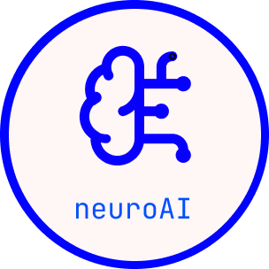

<p align="center">
  <picture>
    <source media="(prefers-color-scheme: dark)" srcset="docs/_static/neuroai_dark.png">
    <source media="(prefers-color-scheme: light)" srcset="docs/_static/neuroai_light.png">
    
  </picture>
</p>

<p align="center">
  <strong>From raw neuroimaging data to state-of-the-art encoding and decoding.</strong><br>
  <sub>Simple. Fast. Robust. Scalable.</sub>
</p>

<p align="center">
  <a href="https://github.com/facebookresearch/neuroai/actions/workflows/ci.yml"></a>
  <a href="https://facebookresearch.github.io/neuroai/"></a>
  <a href="https://github.com/facebookresearch/neuroai/blob/main/LICENSE"></a>
  <a href="https://www.python.org/"></a>
  <a href="https://pytorch.org/"></a>
</p>

<p align="center">
  <a href="https://facebookresearch.github.io/neuroai/">Documentation</a> •
  <a href="#-quickstart">Quickstart</a> •
  <a href="#-packages">Packages</a> •
  <a href="#-contributing">Contributing</a>
</p>

---

<table align="center"><tr><td align="center">
<h3>📖 <a href="https://facebookresearch.github.io/neuroai/">Explore the full documentation →</a></h3>
<p>
Interactive quickstarts &nbsp;·&nbsp; step-by-step tutorials &nbsp;·&nbsp; API reference<br>
<sub>Pick a task, a modality, and a dataset — the docs generate the code for you.</sub>
</p>
<p>
<a href="https://facebookresearch.github.io/neuroai/neuralset/index.html"></a>&nbsp;
<a href="https://facebookresearch.github.io/neuroai/neuralfetch/index.html"></a>&nbsp;
<a href="https://facebookresearch.github.io/neuroai/neuraltrain/index.html"></a>
</p>
</td></tr></table>

<p align="center">
  
</p>

---

## ⚡ Quickstart

```bash
pip install neuralset neuralfetch neuraltrain
```

> **Running the tutorials?** Also install the extras:
> ```bash
> pip install 'neuralset[tutorials]'
> ```

```python
import neuralset as ns

# Discover all registered brain-imaging studies
studies = ns.Study.catalog()
print(f"{len(studies)} studies available")

# Load a study, extract events, build a torch-ready dataset — three lines
study = studies["gwilliams2023"]
events = study.events()
segments = study.segments(events)
```

<p align="center">
  
</p>

## 📦 Packages

neuroai is a modular suite of three packages that snap together:

```
 ┌─────────────────────────────────────────────────────────────┐
 │                        neuraltrain                          │
 │          Deep-learning models, training & metrics           │
 ├─────────────────────────────────────────────────────────────┤
 │                         neuralset                           │
 │   Events · Extractors · Transforms · Segmentation · I/O    │
 ├─────────────────────────────────────────────────────────────┤
 │                        neuralfetch                          │
 │       Public dataset catalog · Download · Caching           │
 └─────────────────────────────────────────────────────────────┘
```

<table>
<tr>
<td width="33%" valign="top">

### <picture><source media="(prefers-color-scheme: dark)" srcset="docs/_static/neuralset_dark.png"></picture> neuralset

Turn raw neuroimaging data into AI-ready datasets.

- Multi-modal: **MEG, EEG, fMRI, EMG, iEEG, text, audio, video**
- Event-driven processing with rich DataFrame semantics
- Composable transforms & torch-native segmentation
- Spacy / HuggingFace extractors out of the box

```bash
pip install neuralset
```

</td>
<td width="33%" valign="top">

### <picture><source media="(prefers-color-scheme: dark)" srcset="docs/_static/neuralfetch_dark.png"></picture> neuralfetch

Access public brain datasets in one command.

- **19+ studies** from OpenNeuro, MOABB, OSF, DANDI…
- Automated download, caching & verification
- Dataset versioning for reproducibility
- Rich metadata & study introspection

```bash
pip install neuralfetch
```

</td>
<td width="33%" valign="top">

### <picture><source media="(prefers-color-scheme: dark)" srcset="docs/_static/neuraltrain_dark.png"></picture> neuraltrain

Deep learning for neuroimaging, batteries included.

- **PyTorch + Lightning** for scalable training
- Specialized architectures (ConvNets, Transformers)
- Domain-specific losses, metrics & augmentations
- Multi-GPU & cluster-ready (SLURM)

```bash
pip install neuraltrain
```

</td>
</tr>
</table>

## 🚀 What You Can Do

<details>
<summary><b>Load & explore a public MEG dataset</b></summary>

```python
import neuralset as ns

study = ns.Study.catalog()["gwilliams2023"]
events = study.events()
print(events.df.head())
```

</details>

<details>
<summary><b>Extract word embeddings alongside brain signals</b></summary>

```python
from neuralset import extractors

emb = extractors.SpacyEmbedding(frequency=0)
emb.prepare(events)
print(emb.shape)  # (300,) — one embedding per word
```

</details>

<details>
<summary><b>Train an encoding model end-to-end</b></summary>

```python
from neuraltrain import models

cfg = models.SimpleConvTimeAgg(hidden=32, depth=4, merger_config=None)
model = cfg.build(n_channels=204, n_times=2700, n_outputs=4)
print(f"Parameters: {sum(p.numel() for p in model.parameters()):,}")
```

</details>

## 🏗️ Project Structure

```
neuroai/
├── neuralset-repo/       # Core pipeline: events, extractors, transforms
├── neuralfetch-repo/     # Dataset catalog and download
├── neuraltrain-repo/     # Models, training loops, metrics
└── docs/                 # Sphinx documentation
```

## 🛠️ Development

```bash
git clone https://github.com/facebookresearch/neuroai.git
cd neuroai

# Create a venv (uv is recommended)
uv venv .venv && source .venv/bin/activate
uv pip install pip                             # needed for spacy model downloads

# Install all packages in editable mode
uv pip install -e 'neuralset-repo/.[dev,all]'
uv pip install -e 'neuralfetch-repo/.'
uv pip install -e 'neuraltrain-repo/.[dev,all]'

# Set up hooks & verify
pre-commit install
pytest neuralset-repo/neuralset -x
```

## 🤝 Contributing

Contributions are welcome! Please see our [contributing guide](CONTRIBUTING.md) for details.

```bash
ruff check .          # lint
ruff format .         # format
mypy neuralset-repo/  # type check
pytest -x             # test
```

## 🔗 Related Projects

- **[exca](https://facebookresearch.github.io/exca/)** — Execution & caching framework powering neuroai's compute graph
- **[MNE-Python](https://mne.tools/)** — Electrophysiology analysis (used internally for MEG/EEG I/O)

## 📝 License

This project is licensed under the [MIT License](LICENSE).

## Third-Party Content

References to third-party content from other locations are subject to
their own licenses and you may have other legal obligations or
restrictions that govern your use of that content.

---

<p align="center">
  <sub>Built with ❤️ at <a href="https://ai.meta.com/">Meta AI</a>
</p>
