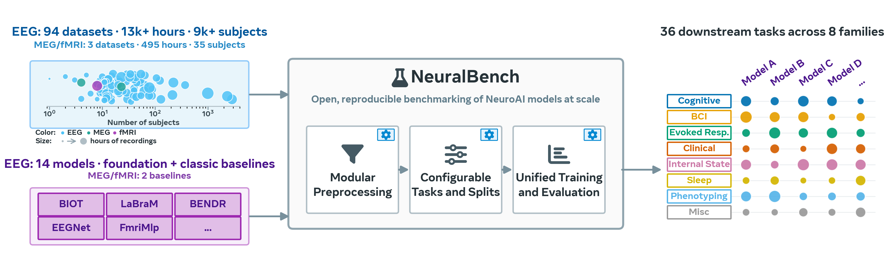
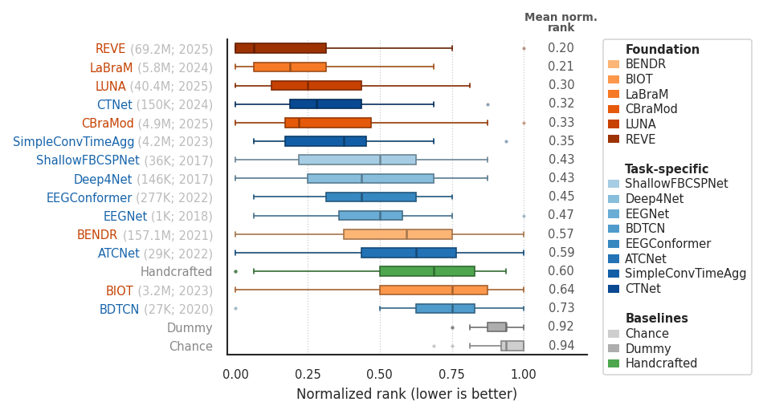

# NeuralBench: Unified benchmark for NeuroAI models

<p align="center">
  
</p>

`neuralbench` is a unified framework to benchmark **NeuroAI models**. It is designed for evaluating pretrained or randomly initialized models on a diverse suite of downstream tasks for brain modeling -- not for pretraining itself. It supports multiple neuroimaging devices -- **EEG**, **MEG**, and **fMRI** -- with more tasks and devices to come.

**Examples**:
```console
neuralbench eeg audiovisual_stimulus -m eegnet   # EEG audiovisual stimulus classification with EEGNet
```

See `neuralbench` in the [documentation](https://facebookresearch.github.io/neuroai/).

## Installation

Install from PyPI:
```console
pip install neuralbench
```

Or install from source (e.g. for development):
```console
cd neuralbench-repo
pip install -e .
```

## Quick start

As an example, let's run the audiovisual stimulus classification task with the default model from EEG. This task uses the [MNE sample dataset](https://mne.tools/stable/documentation/datasets.html#sample), which is small (~1.5 GB) and can be downloaded quickly. We use it both as a sanity-check task and as a probe of model behaviour in very-low-data regimes (a single subject, 288 trials, 4-class classification).

When you first run `neuralbench`, you will be prompted to configure paths for data (`DATA_DIR`), cache (`CACHE_DIR`) and results (`SAVE_DIR`). The configuration will be saved to `~/.neuralbench/config.json` by default. Set `NEURALBENCH_CONFIG=/path/to/config.json` to override this location (useful on shared machines or in CI; see [Custom config location](https://facebookresearch.github.io/neuroai/neuralbench/install.html#custom-config-location)).
If using `Weights & Biases`, see [this section](#weights--biases-setup) for setup instructions.

Evaluate a model on a downstream task in three commands:

```console
neuralbench eeg audiovisual_stimulus --download   # 1. Download the data (here, the Mne2013SampleEeg study)
neuralbench eeg audiovisual_stimulus --prepare    # 2. Prepare cache (preprocessed data and targets)
neuralbench eeg audiovisual_stimulus              # 3. Run the full grid
```

Steps 2 and 3 dispatch to SLURM when it is auto-detected on your machine; step 3 additionally requires `SLURM_PARTITION` to be set in your neuralbench config. Pass `--debug` to either step to force local execution. Step 2 is mostly useful for larger datasets that benefit from parallel preprocessing with SLURM, and is not strictly necessary for `audiovisual_stimulus`. Add `--debug` to any command for a fast local sanity-check run with a subsampled dataset and a limited number of epochs:

```console
neuralbench eeg audiovisual_stimulus --debug      # Local validation run
```

By default, experiments use the EEGNet architecture[^1]; use `-m <model>` to swap models.

[^1]: Lawhern, Vernon J., et al. "EEGNet: a compact convolutional neural network for EEG-based brain–computer interfaces." Journal of neural engineering 15.5 (2018): 056013.

Results can be visualized on `Weights & Biases`, or aggregated locally using `--plot-cached` (see the [Visualizing Results](https://facebookresearch.github.io/neuroai/neuralbench/auto_examples/results/plot_visualize_results.html) tutorial).

<p align="center">
  
</p>
<p align="center"><sub><em>Example output: model rankings on the <code>NeuralBench-EEG-Core v1.0</code> suite (one dataset per task, lower rank is better).</em></sub></p>

> [!TIP]
> See the full [quickstart tutorial](https://facebookresearch.github.io/neuroai/neuralbench/auto_examples/quickstart/01_run_first_task.html) for a walkthrough of the CLI, config system, and model selection.

The same workflow applies to **MEG** and **fMRI** tasks -- just swap the device and task name:
```console
neuralbench meg typing --debug          # MEG keystroke classification in debug mode
neuralbench fmri image --debug          # fMRI image retrieval in debug mode
```

## Running the full EEG benchmark

To run all 36 EEG tasks end-to-end:

```console
neuralbench eeg all --download          # 1. Download all datasets (~3.3 TB)
neuralbench eeg all --prepare           # 2. Build preprocessing cache (~35 GB)
neuralbench eeg all                     # 3. Run all 36 tasks
```

Use `-m all_classic`, `-m all_fm`, or `-m all_classic all_fm` to evaluate across all 8 task-specific EEG models, all 6 EEG foundation models, or all 14 EEG models respectively.

See the [full EEG benchmark guide](https://facebookresearch.github.io/neuroai/neuralbench/full_benchmark.html) for prerequisites, resource requirements (~3.3 TB disk, 1 GPU with 32 GB VRAM per job), dataset variant options, and computational considerations.

> [!IMPORTANT]
> A handful of datasets cannot be fetched automatically and require a one-time manual step (creating an account, accepting a license agreement, or submitting an application form). The affected tasks are `pathology`, `artifact`, and `clinical_event` (TUH EEG Corpus); `image` and `meg/image` (THINGS-images); `emotion` (FACED on Synapse); `video` (SEED-DV); `fmri/image` (NSD); `motor_imagery` and `mental_arithmetic` (Shin2017OpenA and Shin2017OpenB); `eeg/typing` / `meg/typing` (Levy2025Brain, not yet publicly released); and `speech` (Brennan2019 on Deep Blue Data: the legacy `urlretrieve`-based downloader is currently blocked by Cloudflare's bot challenge, so the v1 files must be fetched manually via Globus until upstream restores anonymous HTTP access). See the [Datasets requiring manual download](https://facebookresearch.github.io/neuroai/neuralbench/full_benchmark.html#manual-download-datasets) section of the benchmark guide for the exact steps for each one.

## Weights & Biases setup

If using Weights & Biases for experiment tracking, first set the relevant environment variable:
```console
export WANDB_API_KEY=your_wandb_api_key
```

Then configure the `WandbLoggerConfig` (from `neuraltrain.utils`) accordingly, e.g., by setting the `host`, `name`, `group` and `entity` fields to those of your project.

Leave `WANDB_HOST=""` blank in your neuralbench config to disable W&B logging entirely; results are still written to `SAVE_DIR` and remain accessible via `--plot-cached`.

## Benchmark suites

NeuralBench packages its tasks and datasets into named, versioned evaluation suites. Any reported result should cite a concrete suite, e.g. `NeuralBench-EEG-Core v1.0`. The unqualified name **NeuralBench** refers to the framework only.

**Naming scheme**: `NeuralBench-<Modality>-<Variant> v<Major>.<Minor>`

- **Modality** — `EEG`, `MEG`, `fMRI` (one version history per modality).
- **Variant** — `Core` (one dataset per task; broad coverage across paradigms) or `Full` (every dataset registered for each task; reveals within-task variability). `Full` is always a strict superset of `Core` at the same version.
- **Version** — semver-style tag for the frozen task/dataset/split specification. Minor bumps are additive and back-comparable; major bumps are breaking.

**Current release**:

- **NeuralBench-EEG-Core v1.0** — one dataset × all EEG tasks.
- **NeuralBench-EEG-Full v1.0** — all datasets × all EEG tasks.

## Available Tasks

The following tasks are available in neuralbench, organized by device:

**EEG** (36 tasks): `age`, `artifact`, `audiovisual_stimulus`, `clinical_event`, `cvep`, `dementia_diagnosis`, `depression_diagnosis`, `emotion`, `ern`, `image`, `lrp`, `mental_arithmetic`, `mental_imagery`, `mental_workload`, `mismatch_negativity`, `motor_execution`, `motor_imagery`, `n170`, `n2pc`, `n400`, `p3`, `parkinsons_diagnosis`, `pathology`, `psychopathology`, `reaction_time`, `schizophrenia_diagnosis`, `seizure`, `sentence`, `sex`, `sleep_arousal`, `sleep_stage`, `speech`, `ssvep`, `typing`, `video`, `word`

**MEG** (2 tasks): `image`, `typing`

**fMRI** (1 task): `image`

> [!NOTE]
> More MEG and fMRI tasks are under development. Contributions are welcome!

## Adding a new task

See the [Adding a New Task](https://facebookresearch.github.io/neuroai/neuralbench/auto_examples/adding_task/create_new_task.html) tutorial.

## Adding a new model

See the [Adding a New Model](https://facebookresearch.github.io/neuroai/neuralbench/auto_examples/adding_model/create_new_model.html) tutorial.

## (Advanced) Modifying the training loop

The training loop is implemented in `neuralbench/pl_module.py` as a PyTorch Lightning `LightningModule` (`BrainModule`). Override or extend this class to customize training, validation, or test steps. See the [neuralbench API reference](https://facebookresearch.github.io/neuroai/neuralbench/api.html) for details.

## Contributing

See the [CONTRIBUTING](https://github.com/facebookresearch/neuroai/blob/main/neuralbench-repo/.github/CONTRIBUTING.md) file for how to help out.

## Citing
```bibtex
@misc{banville2026neuralbench,
  title        = {NeuralBench: A Unifying Framework to Benchmark NeuroAI Models},
  author       = {Banville, Hubert and d'Ascoli, St{\'e}phane and Dahan, Simon and Rapin, J{\'e}r{\'e}my and Careil, Marl{\`e}ne and Benchetrit, Yohann and L{\'e}vy, Jarod and Panchavati, Saarang and Ratouchniak, Antoine and Zhang, Mingfang and Cascardi, Elisa and Begany, Katelyn and Brooks, Teon and King, Jean-R{\'e}mi},
  year         = {2026},
  howpublished = {Brain \& AI team, Meta FAIR},
  url          = {https://ai.meta.com/research/publications/neuralbench-a-unifying-framework-to-benchmark-neuroai-models/},
}
```

## Third-Party Content

Third party content pulled from other locations are subject to their own licenses and you may have other legal obligations or restrictions that govern your use of that content.

## License

`neuralbench` is MIT licensed, as found in the LICENSE file.
Also check-out Meta Open Source [Terms of Use](https://opensource.fb.com/legal/terms) and [Privacy Policy](https://opensource.fb.com/legal/privacy).
